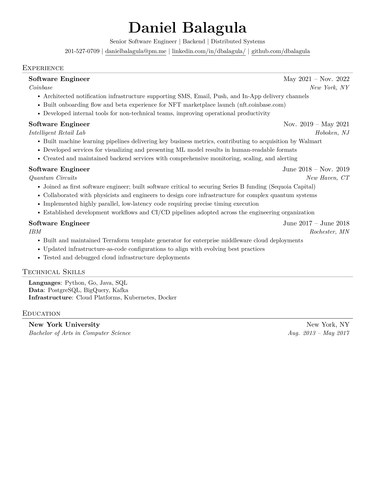

# Daniel Balagula Resume



## Build

This repo uses GitHub Actions to automatically compile the LaTeX source and generate artifacts on every push.

**Manual build** (requires [tectonic](https://tectonic-typesetting.github.io/) and [poppler](https://poppler.freedesktop.org/)):
```bash
tectonic resume.tex
pdftoppm -png -r 300 -singlefile resume.pdf resume
```
